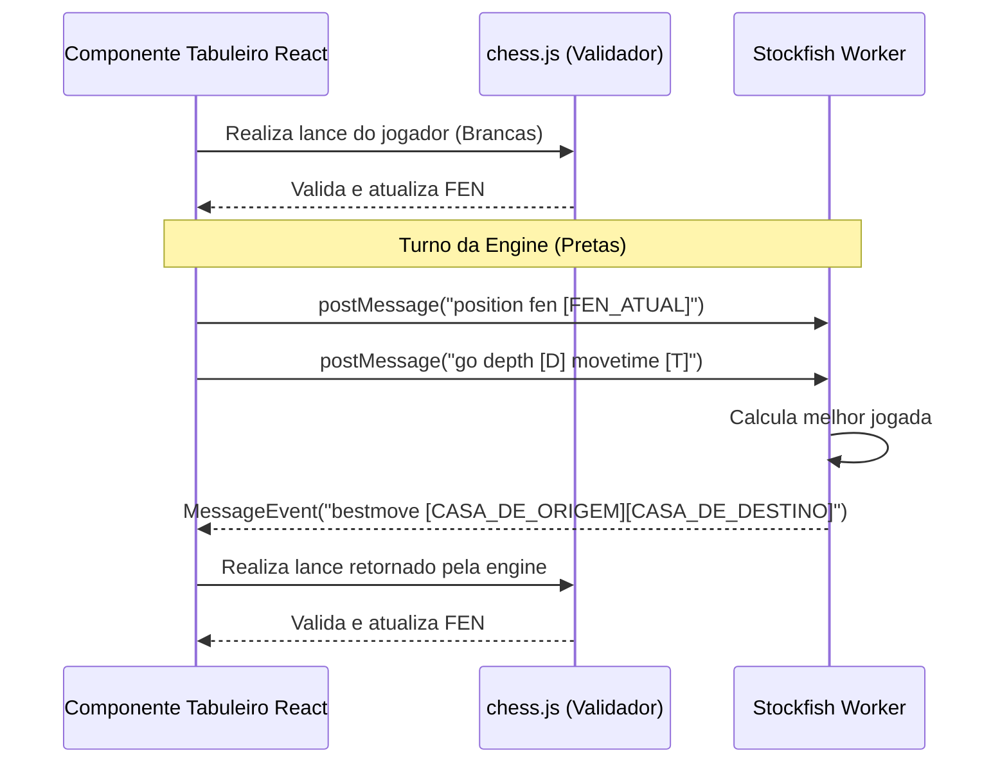

# Especificação Técnica do Frontend - Web Chess

Esta especificação define a arquitetura, gerenciamento de estado e integrações da interface do usuário (UI/UX) para o site de xadrez, utilizando React, TypeScript, Zustand, `chess.js`, `react-chessboard` e Stockfish WASM.

---

## 1. Estrutura de Páginas e Navegação (Roteador Client-side)

A aplicação será uma SPA (Single Page Application). As abas serão controladas por um roteador simples (como `react-router-dom` ou um estado de navegação reativo global).

### 1.1. Tela Inicial ("Jogar")
*   **Seletor de Modo de Jogo:**
    *   **Contra o Robô (Stockfish WASM):** Abre o painel de configuração antes de iniciar a partida:
        *   Níveis de Dificuldade: Seletor de 1 a 5 (Muito Fácil, Fácil, Médio, Difícil, Muito Difícil).
        *   Seleção de Cor: Brancas, Pretas ou Aleatório.
        *   Controle de Tempo: Sem tempo, 30 min, 10 min, 5 min, 3 min, 1 min.
    *   **1v1 Local:** Abre o painel de configuração antes de iniciar a partida:
        *   Rotação Automática: Opção de habilitar/desabilitar.
        *   Atribuição de Cores: Escolher cor para Jogador 1 e Jogador 2, ou Aleatório.
        *   Controle de Tempo: Sem tempo, 30 min, 10 min, 5 min, 3 min, 1 min.
*   **Área do Tabuleiro:** O tabuleiro ocupa a área central. Painéis com avatares e relógios são exibidos acima e abaixo.
*   **Painel de Ações Ativas:** Botão para desistir (resign), propor empate, pausar jogo (se local).

### 1.2. Aba "Aprender"
Apresenta um dicionário interativo do xadrez:
*   **Peças de Xadrez:** Seletor com Peão, Bispo, Cavalo, Torre, Dama e Rei. Ao selecionar, exibe:
    *   Nome, pontuação/valor teórico e descrição funcional.
    *   Um mini-tabuleiro interativo demonstrando os movimentos possíveis da peça selecionada.
*   **Movimentos Especiais:** Explicações textuais e mini-tabuleiros interativos para:
    *   Roque (Pequeno e Grande).
    *   Captura *En Passant*.
    *   Promoção de Peão.
    *   Condições de Empate (Afogamento/Stalemate, Insuficiência de Material, Tripla Repetição, Regra dos 50 movimentos).

### 1.3. Aba "Perfil"
Dividida em três sub-abas internas:
*   **Perfil Geral:** Edição de Nome e foto de perfil (upload de imagem ou avatares predefinidos).
*   **Oponente Local:** Edição de Nome e foto do oponente local (para exibição no modo 1v1 local). Por padrão, exibe "Oponente" e sem foto (avatar genérico).
*   **Estatísticas:**
    *   **Filtros:**
        *   Tipo de Jogo: `VS Engine`, `1v1 Local` ou `Ambos` (VS Engine + 1v1 Local).
        *   Período: `Últimos 7 dias`, `Último mês`, `Todos`.
    *   **Métricas Exibidas:**
        *   Vitórias, Derrotas, Empates (valores absolutos).
        *   Média de lances por partida.
        *   **Percentual de Vitórias/Derrotas/Empates (Cálculo 1):** $\frac{\text{Vitórias}}{\text{Total de Partidas}}$
        *   **Percentual de Vitórias/Derrotas (Cálculo 2):** $\frac{\text{Vitórias}}{\text{Vitórias} + \text{Derrotas}}$ (Exclui empates do cálculo).
    *   **Ações:**
        *   Exportar Estatísticas: Gera um arquivo `.json` ou copia como texto formatado para a área de transferência.
        *   Ver Estatísticas Avançadas (Redirecionamento externo).
*   **Histórico de Partidas:**
    *   Lista de partidas anteriores contendo: oponente, data, resultado, controle de tempo e PGN.
    *   **Visualizador Individual:** Ao clicar em uma partida, abre um modal de análise:
        *   Visualização gráfica do tabuleiro.
        *   Painel lateral com a notação algébrica padrão (PGN) dos lances.
        *   Navegação manual por lances: Setas direcionais do teclado (esquerda/direita) ou botões `<` e `>` na UI.
        *   Botão **"Replay Automático"**.

### 1.4. Aba "Personalizar"
*   **Temas do Tabuleiro:** Seleção entre os temas definidos (Modern Ice, Classic Wood, Cyberpunk, Minimalist).
*   **Temas das Peças:** Seleção de peças (Neo-Classic, Silhouette, Geometric).

---

## 2. Gerenciamento de Estado (Zustand Stores)

Utilizaremos três stores principais para separar as preocupações e facilitar o desenvolvimento de lógica minimalista:

### 2.1. `gameStore`
Controla o estado do jogo ativo:
```typescript
interface GameState {
  game: Chess; // Instância do chess.js
  fen: string; // FEN da posição atual
  pgn: string; // Notação PGN atual
  moveHistory: {
    san: string;
    fenAfter: string;
    timeRemainingWhite: number; // Em milissegundos
    timeRemainingBlack: number; // Em milissegundos
    timestamp: number;          // Epoch timestamp do lance
  }[];
  whiteTime: number; // Tempo restante em ms para as Brancas
  blackTime: number; // Tempo restante em ms para as Pretas
  activeColor: 'w' | 'b';
  gameStatus: 'idle' | 'playing' | 'draw' | 'checkmate' | 'timeout' | 'resigned';
  winner: 'w' | 'b' | null;
  drawReason: string | null;
  config: GameConfig | null;
  
  // Ações
  setupGame: (config: GameConfig) => void;
  makeMove: (from: string, to: string, promotion?: string) => boolean;
  tickClocks: () => void;
  resign: (color: 'w' | 'b') => void;
  triggerTimeout: () => void;
  resetGame: () => void;
}
```

### 2.2. `settingsStore`
Mantém preferências visuais e do sistema:
```typescript
interface SettingsState {
  boardTheme: 'modern-ice' | 'wood' | 'cyberpunk' | 'minimalist';
  pieceTheme: 'neo-classic' | 'silhouette' | 'geometric';
  autoRotateLocal: boolean;
  setBoardTheme: (theme: any) => void;
  setPieceTheme: (theme: any) => void;
  setAutoRotateLocal: (val: boolean) => void;
}
```

---

## 3. Integração com Engine Stockfish (Web Worker + UCI)

A engine rodará localmente. Para evitar que o thread da UI trave, a engine do Stockfish será instanciada em um Web Worker e a comunicação será via troca de mensagens UCI.

### 3.1. Arquitetura do Worker (`stockfish.worker.ts`)
*   O script importa a build do `stockfish.js` que compila para WebAssembly.
*   O componente React ou hook `useStockfish` interage com o worker via `postMessage`.

### 3.2. Mapeamento de Dificuldades (Comandos UCI)
Antes do início da partida contra a engine, o sistema configura a força do robô enviando comandos UCI apropriados:

1.  **Muito Fácil (Nível 1):**
    *   UCI Options: `setoption name Skill Level value 0`
    *   Busca: `go depth 1 movetime 100` (Busca superficial, responde em até 100ms)
2.  **Fácil (Nível 2):**
    *   UCI Options: `setoption name Skill Level value 5`
    *   Busca: `go depth 3 movetime 300`
3.  **Médio (Nível 3):**
    *   UCI Options: `setoption name Skill Level value 10`
    *   Busca: `go depth 8 movetime 800`
4.  **Difícil (Nível 4):**
    *   UCI Options: `setoption name Skill Level value 15`
    *   Busca: `go depth 14 movetime 1500`
5.  **Muito Difícil (Nível 5):**
    *   UCI Options: `setoption name Skill Level value 20`
    *   Busca: `go depth 20 movetime 3000` (Usa força total e profundidade padrão da engine)

### 3.3. Ciclo de Jogada da Engine


---

## 4. Lógica e Precisão do Controle de Tempo (Relógio)

*   **Problema Comum:** `setInterval` atrasa quando a aba do navegador perde o foco (background throttling).
*   **Solução:** Armazenar um timestamp absoluto (`Date.now()`) no início do turno do jogador. A cada tick do relógio (controlado por `requestAnimationFrame` ou timer de alta precisão), o tempo restante é atualizado calculando:
    $$\text{Tempo Restante} = \text{Tempo Inicial do Turno} - (\text{Date.now()} - \text{Timestamp do Início do Turno})$$
*   Se o tempo restante atingir $\le 0$, a store dispara a ação `triggerTimeout()` encerrando o jogo por tempo esgotado.

---

## 5. Replay Automático e Navegação no Histórico

### 5.1. Reprodução Automática com Ritmo Original
Quando o replay automático de uma partida concluída é ativado:
1.  O sistema redefine o tabuleiro (`chess.js`) para a posição inicial.
2.  Lê o array `moveHistory` da partida, o qual contém o tempo restante de cada jogador no momento do lance.
3.  Calcula a duração do lance (delay):
    $$\text{Delay} = \text{Tempo Restante Anterior} - \text{Tempo Restante Atual do jogador que jogou}$$
4.  Agenda a execução do próximo lance com um `setTimeout` equivalente ao `Delay` calculado. Isso garante que a reprodução aconteça exatamente no mesmo ritmo físico que os jogadores usaram na partida original.
5.  O usuário pode pausar o replay automático a qualquer momento, retomando o controle manual.

### 5.2. Navegação Manual
*   A navegação no histórico limpa timers ativos.
*   Usa-se um índice simples (`currentMoveIndex`) sobre o array de histórico.
*   **Seta Direita / Botão Avançar:** Incrementa o índice e atualiza o tabuleiro para `moveHistory[currentMoveIndex].fenAfter`.
*   **Seta Esquerda / Botão Voltar:** Decrementa o índice e atualiza o tabuleiro para o FEN anterior (ou FEN inicial se o índice for $< 0$).

---

## 6. Exportação e Estatísticas Avançadas Externas

### 6.1. Redirecionamento e Exportação de PGN
*   **Botão "Ver estatísticas avançadas":** Redireciona o usuário em uma nova aba (`target="_blank"`) para uma ferramenta de análise externa (ex: Lichess Import `/paste` ou Chess.com Analysis).
*   **Exportação Automática:** O frontend disponibiliza o PGN padrão da partida ativa ou selecionada:
    *   Cria um arquivo Blob contendo o texto PGN e faz o download automático (`partida_xadrez.pgn`).
    *   Usa a Clipboard API (`navigator.clipboard.writeText(pgn)`) para copiar instantaneamente o PGN.
    *   Informa o usuário com uma mensagem clara sobre o redirecionamento.
